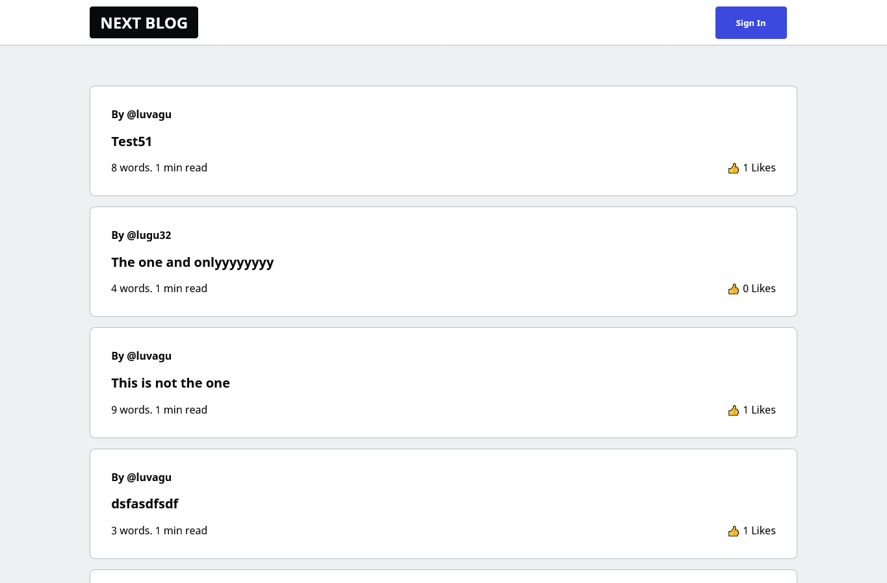

<p align="center">
  <a href="https://nextjs-blog-pied-iota.vercel.app">
    
    <h1 align="center">Next Blog</h1>
  </a>
</p>

> Next.js / Firebase / Custom usernames / TypeScript

Full Stack `Simple Social Blog` that lets authors create content using custom usernames while other users can like posts.

------

## Main Features

- Hybrid pages featuring both `Static & Server Side Rendering` and `SEO`
- Static pages also feature `Incremental Static Regeneration`
- Bot friendly URLs and content
- Custom usernames with `Firebase Auth`
- Upload images in posts
- Write post in markdown format
- Firebase realtime data and CRUD
- Realtime post likes
- Toast messages and loader indicator

## Cloning this repo

Be sure to create a Firebase app before cloning this repo as you need to create a `.env.local` file and add the correct API Keys for your project to work properly.

```bash
git clone https://github.com/luvagu/nextjs-blog.git

cd nextjs-blog

npm install

npm run dev
```

## Live Demo

Try the live demo at: https://nextjs-blog-pied-iota.vercel.app

